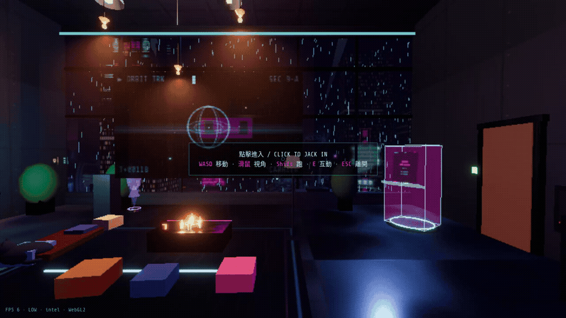

# NEON LOFT

A walkable rainy-night cyberpunk room in the browser. Three.js + TypeScript.

**[▶ Live demo](https://cyberpunk-room.vercel.app)**



## Controls

| Desktop | Mobile |
|---|---|
| WASD move · mouse look · Shift run · E interact · ESC exit | joystick move · swipe look · tap interact |

## Run locally

```bash
npm install
npm run dev
```

## Feedback

Open an issue — especially for performance reports (fps + GPU) and "this part doesn't work" takes.
